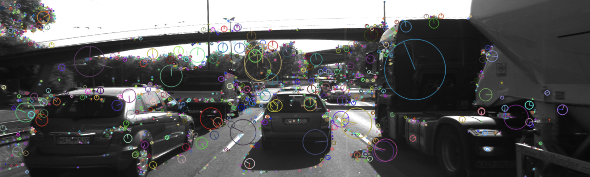

# SFND 2D Feature Tracking

The idea of the camera course is to build a collision detection system - that's the overall goal for the Final Project. As a preparation for this, you will now build the feature tracking part and test various detector / descriptor combinations to see which ones perform best. This mid-term project consists of four parts:

* First, you will focus on loading images, setting up data structures and putting everything into a ring buffer to optimize memory load. 
* Then, you will integrate several keypoint detectors such as HARRIS, FAST, BRISK and SIFT and compare them with regard to number of keypoints and speed. 
* In the next part, you will then focus on descriptor extraction and matching using brute force and also the FLANN approach we discussed in the previous lesson. 
* In the last part, once the code framework is complete, you will test the various algorithms in different combinations and compare them with regard to some performance measures. 

See the classroom instruction and code comments for more details on each of these parts. Once you are finished with this project, the keypoint matching part will be set up and you can proceed to the next lesson, where the focus is on integrating Lidar points and on object detection using deep-learning. 

## Dependencies for Running Locally
* cmake >= 2.8
  * All OSes: [click here for installation instructions](https://cmake.org/install/)
* make >= 4.1 (Linux, Mac), 3.81 (Windows)
  * Linux: make is installed by default on most Linux distros
  * Mac: [install Xcode command line tools to get make](https://developer.apple.com/xcode/features/)
  * Windows: [Click here for installation instructions](http://gnuwin32.sourceforge.net/packages/make.htm)
* OpenCV >= 4.1
  * This must be compiled from source using the `-D OPENCV_ENABLE_NONFREE=ON` cmake flag for testing the SIFT and SURF detectors.
  * The OpenCV 4.1.0 source code can be found [here](https://github.com/opencv/opencv/tree/4.1.0)
* gcc/g++ >= 5.4
  * Linux: gcc / g++ is installed by default on most Linux distros
  * Mac: same deal as make - [install Xcode command line tools](https://developer.apple.com/xcode/features/)
  * Windows: recommend using [MinGW](http://www.mingw.org/)

## Basic Build Instructions

1. Clone this repo.
2. Make a build directory in the top level directory: `mkdir build && cd build`
3. Compile: `cmake .. && make`
4. Run it: `./2D_feature_tracking`.

## Technical Reference

This project exposes four configuration axes:

- `detectorType`: how salient image locations are found
- `descriptorType`: how a local patch around each keypoint is encoded
- `matcherType`: how descriptor vectors are compared across frames
- `selectorType`: how many candidate matches are considered and filtered

The implementation entry points are:

- `detKeypointsShiTomasi`, `detKeypointsHarris`, `detKeypointsModern` in `src/matching2D.cpp`
- `descKeypoints` in `src/matching2D.cpp`
- `matchDescriptors` in `src/matching2D.cpp`

### Detector Types

Detectors answer one question: "where in the image are repeatable, distinctive points likely to be found?"

#### `SHITOMASI`

Shi-Tomasi is a corner detector derived from the Harris formulation. It computes the second-moment matrix over a local image patch and scores a point using the smaller eigenvalue of that matrix. The intuition is that a corner should have strong intensity change in two independent directions.

Plain English:

Shi-Tomasi looks for "good corners" such as the edges of tail lights, license plate corners, or strong structural points on a car. These are points that are easier to find again in the next frame.

Technical characteristics:

- gradient-based corner detector
- good localization accuracy
- robust for structured man-made scenes
- not inherently scale invariant
- typically returns many strong corners on textured vehicle boundaries, windows, and lights

In this project it is implemented using `cv::goodFeaturesToTrack`, which wraps the Shi-Tomasi score and non-maximum suppression.

Advantages:

- simple and reliable baseline
- accurate corner localization
- usually fast enough for small to medium image sets

Disadvantages:

- not robust to strong scale changes
- only finds corner-like structures, not broader keypoint types
- less descriptive on its own than a full scale-space detector

#### `HARRIS`

Harris also uses the second-moment matrix, but scores corners using:

`R = det(M) - k * trace(M)^2`

This penalizes edge-like responses while retaining points with strong variation in both directions. Harris is historically important because it gives stable corners with precise localization.

Plain English:

Harris also looks for corners, but it uses a classic scoring rule that tends to favor stable, sharp image structures. It is a traditional corner detector that is still useful for understanding the mechanics of feature extraction.

Technical characteristics:

- gradient-based corner detector
- accurate localization
- good repeatability under small viewpoint changes
- not scale invariant
- usually denser than necessary unless thresholding and NMS are tuned carefully

In this project, Harris is implemented manually using `cv::cornerHarris`, thresholding, and overlap-based non-maximum suppression. That manual step matters because it teaches how raw response maps turn into a sparse keypoint set.

Advantages:

- very instructive mathematically
- precise corner localization
- good for understanding non-maximum suppression and thresholding

Disadvantages:

- more manual tuning work than Shi-Tomasi
- not scale invariant
- can produce too many clustered responses if thresholds are loose

#### `FAST`

FAST is a high-speed corner detector. It tests a Bresenham circle around a candidate pixel and checks whether a contiguous set of pixels is significantly brighter or darker than the center. It is designed for computational efficiency rather than explicitly modeling image structure.

Plain English:

FAST is built for speed. It quickly checks whether a pixel looks like a corner by comparing it with pixels in a ring around it. If you want something lightweight and fast, FAST is usually one of the first choices.

Technical characteristics:

- extremely fast
- corner-like but not scale invariant
- often used in real-time SLAM / VO front ends
- depends heavily on threshold selection
- commonly paired with lightweight binary descriptors

FAST is a detector only. It does not define a descriptor.

Advantages:

- extremely fast
- good for real-time pipelines
- simple and practical when paired with a good descriptor

Disadvantages:

- less robust than heavier detectors in difficult conditions
- not scale invariant
- detector only, so it must be paired with a descriptor from somewhere else

#### `BRISK`

BRISK provides both a detector and a descriptor family. As a detector, it uses AGAST-like keypoint detection in scale space and estimates orientation from local intensity patterns.

Plain English:

BRISK tries to balance speed and robustness. It is more sophisticated than FAST, but still much lighter than SIFT. In many practical cases it gives a good middle ground.

Technical characteristics:

- scale-aware relative to simpler corner detectors
- rotation-aware
- designed for binary descriptor pipelines
- usually a strong practical compromise between speed and robustness

As a detector, BRISK tends to produce a balanced set of repeatable points while remaining fast enough for embedded or near-real-time pipelines.

Advantages:

- good speed/quality tradeoff
- handles rotation better than plain FAST
- works naturally with binary matching pipelines

Disadvantages:

- still less robust than SIFT in harder viewpoint or scale changes
- can be noisier than more selective detectors

#### `ORB`

ORB combines FAST keypoint detection with orientation estimation and a learned binary descriptor scheme derived from BRIEF. It was designed as a fast alternative to SIFT/SURF without patent restrictions.

Plain English:

ORB is a fast, practical all-rounder. It takes FAST-style detection and makes it much more useful by adding orientation handling and a stronger descriptor design.

Technical characteristics:

- fast
- rotation-aware
- multi-scale pyramid support
- binary descriptor pipeline
- widely used in real-time systems

ORB is attractive because it upgrades FAST with orientation and pyramid handling, making it much more usable in practice.

Advantages:

- fast and widely used
- more robust than plain FAST + BRIEF
- good default choice for real-time systems

Disadvantages:

- still generally less distinctive than SIFT
- can become unstable in very repetitive textures

#### `AKAZE`

AKAZE detects keypoints in nonlinear scale spaces rather than the Gaussian pyramid used by SIFT/SURF-style methods. This gives it stronger structure preservation around edges and fine details.

Plain English:

AKAZE is a more selective and structured detector. It tries to keep meaningful detail while building scale information, so it can be strong when you need better feature quality than the fastest binary methods.

Technical characteristics:

- scale-aware
- usually more selective than FAST/ORB
- strong performance on structured scenes
- descriptor family is specialized
- computationally heavier than the fastest binary methods

Important project constraint:

- `AKAZE` descriptors are intended to be used with `AKAZE` keypoints

Advantages:

- often strong quality for structured scenes
- better scale handling than simple corner detectors
- good balance between robustness and efficiency

Disadvantages:

- slower than FAST/ORB/BRISK
- more constrained in valid detector-descriptor pairing

#### `SIFT`

SIFT finds extrema in Difference-of-Gaussians scale space, assigns orientation based on local gradient histograms, and is designed to be invariant to image scale and rotation.

Plain English:

SIFT is the accuracy-first option. It is heavier and slower, but it usually gives very distinctive and reliable features, especially when images change in scale or orientation.

Technical characteristics:

- highly distinctive
- robust to scale and rotation changes
- gradient-histogram based, floating-point pipeline
- computationally more expensive than binary methods
- historically a benchmark for robustness

SIFT is often the most reliable option in terms of descriptor distinctiveness, but it usually loses on raw speed.

Advantages:

- very robust and distinctive
- handles scale and rotation well
- excellent baseline for high-quality matching

Disadvantages:

- slower than binary approaches
- larger descriptor memory footprint
- often too expensive for tight real-time budgets

### Descriptor Types

Descriptors answer a different question: "once a keypoint is detected, how do we numerically encode its local neighborhood so it can be matched later?"

Descriptors in this project fall into two broad families:

- binary descriptors: compact bit patterns, fast to compare, typically matched with Hamming distance
- floating-point / histogram descriptors: richer representation, slower, typically matched with L2 distance

#### `BRISK`

BRISK descriptors are binary strings built from pairwise intensity comparisons sampled over a circular pattern around the keypoint. Long-distance pairs are also used for orientation estimation.

Plain English:

BRISK describes what the area around a keypoint looks like using lots of yes/no intensity comparisons. That makes it compact and quick to compare.

Technical characteristics:

- binary descriptor
- compact and fast
- rotation-aware
- usually matched with Hamming distance
- a strong baseline for real-time pipelines

Advantages:

- fast to compute and match
- compact binary representation
- good baseline for practical real-time setups

Disadvantages:

- less descriptive than SIFT in difficult matching scenarios
- can degrade under stronger appearance changes

#### `BRIEF`

BRIEF is one of the simplest binary descriptors. It compares intensities at selected point pairs inside a smoothed image patch and stores the outcomes as bits.

Plain English:

BRIEF is the lightweight descriptor: it asks lots of simple "is this pixel brighter than that one?" questions and stores the answers as bits.

Technical characteristics:

- binary descriptor
- very fast
- low memory footprint
- not intrinsically rotation invariant
- best when paired with a detector that provides stable orientation externally

Its simplicity is exactly why it remains instructive: it shows how much can be achieved with very lightweight local binary tests.

Advantages:

- very fast
- very compact
- easy to understand and efficient in practice

Disadvantages:

- weak on rotation unless paired with orientation compensation
- generally less robust than more advanced descriptors

#### `ORB`

ORB’s descriptor is a steered version of BRIEF. The sampling pattern is rotated according to the keypoint orientation so that the descriptor becomes more robust to in-plane rotation.

Plain English:

ORB descriptor is basically BRIEF with better handling of rotation. It keeps the speed benefits of binary descriptors while making them more stable.

Technical characteristics:

- binary descriptor
- rotation-aware
- fast to compute and match
- strong practical improvement over plain BRIEF

Advantages:

- strong speed/robustness compromise
- better rotation behavior than BRIEF
- efficient binary matching

Disadvantages:

- still usually not as distinctive as SIFT
- can struggle in highly repetitive patterns

#### `FREAK`

FREAK uses a retinal sampling pattern: denser near the center, coarser toward the outside. That mimics biological vision and gives a binary descriptor with strong central sensitivity and efficient matching.

Plain English:

FREAK pays more attention to the center of the keypoint and less to the outside, a bit like how human vision focuses detail near the center. This often works well for object-like structures.

Technical characteristics:

- binary descriptor
- robust and compact
- often strong on object-centric matching
- computationally light relative to floating-point descriptors

Advantages:

- compact and efficient
- often good distinctiveness for binary matching
- useful for object-focused features

Disadvantages:

- still less expressive than SIFT
- performance depends on detector quality and image structure

#### `AKAZE`

AKAZE descriptors are built around the nonlinear scale-space formulation of the detector. They are intended to preserve the detector’s scale-space semantics.

Plain English:

AKAZE descriptor is designed to match the AKAZE detector closely. It is meant to work as a consistent pair rather than a mix-and-match generic option.

Technical characteristics:

- usually binary in practical OpenCV pipelines
- tightly coupled to AKAZE keypoint extraction
- good distinctiveness-speed tradeoff

Project compatibility note:

- use `AKAZE` descriptor with `AKAZE` detector

Advantages:

- strong detector-descriptor consistency
- good robustness/speed balance
- works well when AKAZE keypoints are already selected

Disadvantages:

- less flexible in pairings
- not as lightweight as simpler binary descriptors

#### `SIFT`

SIFT descriptors build a histogram-of-gradients representation over spatial cells around a keypoint. This produces a floating-point vector with strong distinctiveness under moderate geometric and photometric change.

Plain English:

SIFT descriptor captures the shape of local gradients around a keypoint in a rich numeric form. It is much heavier than binary descriptors, but usually much more informative.

Technical characteristics:

- floating-point descriptor
- matched with L2 distance
- highly distinctive
- heavier compute and memory cost

Advantages:

- very reliable matches
- robust to many real-world image changes
- strong choice when accuracy matters more than speed

Disadvantages:

- slower to compute
- slower and heavier to match
- larger memory use

### Matcher Types

Matchers define how one descriptor from frame `t` is compared against descriptors from frame `t+1`.

#### `MAT_BF`

Brute-force matching literally compares candidate descriptors directly using the appropriate distance metric.

Plain English:

Brute-force matching is the simplest idea: compare one descriptor against all candidates and pick the closest one.

Technical characteristics:

- exact search
- simple and predictable
- slower than approximate methods for large descriptor sets
- best conceptual baseline

Distance metric selection in this project:

- `DES_BINARY` -> `cv::NORM_HAMMING`
- `DES_HOG` -> `cv::NORM_L2`

This split matters because binary descriptors are bit strings, while histogram / floating-point descriptors need Euclidean distance.

Advantages:

- exact and easy to reason about
- reliable baseline for experiments
- works well for small to moderate descriptor sets

Disadvantages:

- can get expensive as the number of descriptors grows
- not the most scalable option

#### `MAT_FLANN`

FLANN stands for Fast Library for Approximate Nearest Neighbors. It accelerates nearest-neighbor lookup by using indexing structures rather than exhaustively comparing every descriptor.

Plain English:

FLANN tries to find close matches faster by using search structures instead of checking everything exhaustively. It trades some exactness for speed.

Technical characteristics:

- approximate nearest-neighbor search
- beneficial when descriptor sets grow larger
- especially natural for floating-point descriptors
- requires care with binary descriptors in OpenCV

Project-specific implementation detail:

- OpenCV’s FLANN path expects descriptors in `CV_32F`
- binary descriptors therefore need conversion before matching

That conversion is a practical workaround for OpenCV’s matcher interface rather than a claim that binary descriptors become conceptually floating-point descriptors.

Advantages:

- can scale better than brute force for larger sets
- natural fit for floating-point descriptors like SIFT
- useful when descriptor counts become large

Disadvantages:

- more implementation detail and edge cases
- approximate rather than conceptually exact
- awkward with binary descriptors in OpenCV because of required conversion

### Selector Types

Selectors define how candidate matches are accepted once the matcher has produced nearest-neighbor results.

#### `SEL_NN`

Nearest-neighbor selection keeps only the single best match for each source descriptor.

Plain English:

This just says: "for each point here, keep the closest point over there."

Technical characteristics:

- simplest possible selection rule
- fast
- often includes more ambiguous matches
- useful as a baseline

This strategy answers: "which reference descriptor is closest?" but it does not ask whether that answer is unique or reliable.

Advantages:

- simplest selection rule
- fast
- easy to debug and understand

Disadvantages:

- keeps more ambiguous matches
- usually noisier than ratio-filtered KNN

#### `SEL_KNN`

K-nearest-neighbor selection returns the top `k` matches per source descriptor. In this project, `k = 2`, because the pipeline uses Lowe’s ratio test.

Plain English:

Instead of only asking for the best match, this asks for the best and second-best match. That lets you see whether the best one is clearly better or just barely better.

Technical characteristics:

- provides ambiguity information
- slightly more work than nearest-neighbor
- enables robust filtering

The ratio test accepts a match only if:

`best.distance < 0.8 * secondBest.distance`

Interpretation:

- if the best and second-best matches are very close, the match is ambiguous
- if the best is clearly better, the correspondence is more trustworthy

This is one of the most important practical filters in local feature matching.

Advantages:

- removes many ambiguous false matches
- much more reliable than plain nearest-neighbor
- standard best practice in feature matching pipelines

Disadvantages:

- a little slower than plain NN
- can reject some borderline but still usable matches if the threshold is strict

### Compatibility and Distance Rules

The project effectively operates with two descriptor classes:

- `DES_BINARY`: BRISK, BRIEF, ORB, FREAK, AKAZE
- `DES_HOG`: SIFT

Recommended matching rules:

- binary descriptors -> BF + Hamming is the cleanest baseline
- SIFT -> BF + L2 or FLANN
- FLANN requires descriptor conversion to `CV_32F` in this implementation

Important compatibility caveat:

- `AKAZE` descriptor should be paired with `AKAZE` keypoints

### Practical Tradeoffs

If you optimize for speed:

- detectors: `FAST`, `ORB`, `BRISK`
- descriptors: `BRIEF`, `ORB`, `BRISK`, `FREAK`
- matcher: `MAT_BF`
- selector: `SEL_KNN` with ratio test

If you optimize for robustness:

- detectors: `SIFT`, `AKAZE`, sometimes `HARRIS`
- descriptors: `SIFT`, `AKAZE`
- matcher: `MAT_BF` or `MAT_FLANN`
- selector: `SEL_KNN`

If you want a balanced real-time baseline in this project:

- `FAST + BRISK`
- `FAST + BRIEF`
- `ORB + ORB`

If you want a strong accuracy-oriented baseline:

- `SIFT + SIFT`

### What Each Layer Contributes

It helps to separate the pipeline into responsibilities:

- detector: picks candidate image locations
- descriptor: encodes local appearance around those locations
- matcher: computes nearest neighbors between descriptor sets
- selector: rejects ambiguous correspondences

Poor matching quality can come from any layer:

- bad detector -> unstable or low-value keypoints
- weak descriptor -> non-distinctive local encoding
- wrong matcher metric -> invalid distance comparisons
- weak selector -> too many false positives
