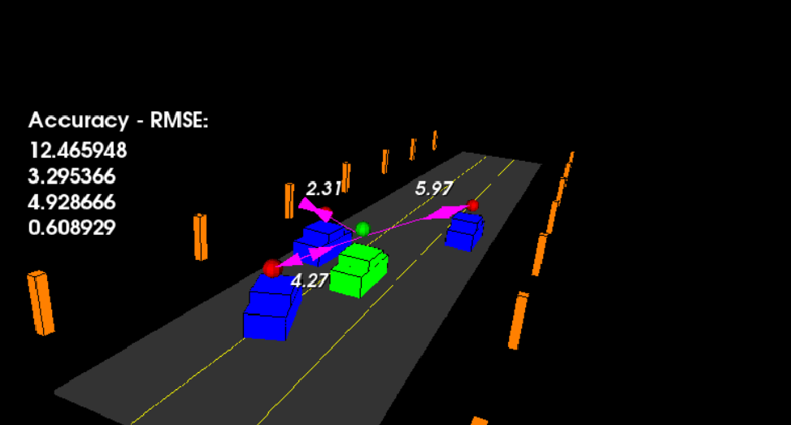

# Highway Object Tracking with Advanced Kalman Filters

Multi-model Kalman Filter implementation for highway vehicle tracking using sensor fusion (Lidar + Radar).


This project implements three different Kalman filter approaches:
- **EKF** (Extended Kalman Filter) - Linear approximation-based tracking
- **UKF** (Unscented Kalman Filter) - Sigma points-based nonlinear tracking  
- **IMM** (Interacting Multiple Model) - Advanced 4-model adaptive filter

The goal is to estimate the state of multiple cars on a highway using noisy lidar and radar measurements with minimal RMSE (Root Mean Square Error).

## Prerequisites

**Eigen Library:**  
This project requires the Eigen library for linear algebra operations.

**PCL (Point Cloud Library):**  
Version 1.2 or higher for 3D visualization.

**macOS Note:**  
If you have Eigen 5.x installed but PCL requires 3.3, the build system includes wrapper config files to handle version compatibility.

For original sensor data and additional setup instructions, refer to:  
**[https://github.com/udacity/SFND_Unscented_Kalman_Filter](https://github.com/udacity/SFND_Unscented_Kalman_Filter)**

---

## Project Structure

```
Filters/
├── CMakeLists.txt              # Build configuration
├── README.md                   # This file
├── src/
│   ├── filters/                # All filter implementations
│   │   ├── README.md           # Filter comparison guide
│   │   ├── ekf/                # Extended Kalman Filter
│   │   │   ├── ekf.hpp
│   │   │   └── ekf.cpp
│   │   ├── ukf/                # Unscented Kalman Filter
│   │   │   ├── ukf.h
│   │   │   └── ukf.cpp
│   │   └── imm/                # Interacting Multiple Model Filter
│   │       ├── IMM.hpp
│   │       ├── IMM.cpp
│   │       └── IMM_README.md
│   ├── motion_models/          # Motion models for IMM
│   │   ├── README.md
│   │   ├── cv_ekf.h/cpp        # Constant Velocity (EKF)
│   │   ├── ca_ekf.h/cpp        # Constant Acceleration (EKF)
│   │   ├── ctrv_ukf.h/cpp      # Constant Turn Rate + Velocity (UKF)
│   │   └── ctra_ukf.h/cpp      # Constant Turn Rate + Accel (UKF)
│   ├── render/                 # 3D visualization
│   ├── sensors/                # Lidar/Radar sensor models
│   ├── highway.h               # Highway simulation
│   ├── main.cpp                # Entry point
│   └── tools.cpp/h             # RMSE calculation
└── build/                      # Build outputs
    ├── filters_highway         # EKF/UKF executable
    └── imm_highway             # IMM executable
```

---

## Filter Selection Guide

### 1. EKF vs UKF (filters_highway)

**How to Switch Between EKF and UKF:**

Edit `src/highway.h` line 24:

```cpp
// Use EKF instead of UKF (false = UKF, true = EKF)
bool use_ekf = true;   // EKF mode
bool use_ekf = false;  // UKF mode (default)
```

**When to Use Each:**

| Filter | Best For | Accuracy | Speed | Complexity |
|--------|----------|----------|-------|------------|
| **EKF** | Linear/simple motion | Medium | Fast | Low |
| **UKF** | Nonlinear motion (turning) | High | Medium | Medium |
| **IMM** | Mixed/unknown motion | Highest | Slower | High |

### 2. IMM Filter (imm_highway)

The IMM combines **4 motion models** and automatically switches between them:

- **CV (Constant Velocity)**: Straight driving, no acceleration
- **CA (Constant Acceleration)**: Accelerating/braking
- **CTRV (Constant Turn Rate + Velocity)**: Turning at steady speed
- **CTRA (Constant Turn Rate + Acceleration)**: Turning while accelerating

**Why Different Filters for Different Models?**

| Model | Filter | Reason |
|-------|--------|--------|
| CV, CA | **EKF** | Linear/quasi-linear equations, computationally efficient |
| CTRV, CTRA | **UKF** | Highly nonlinear (sin/cos in state transitions), UKF handles better |

This hybrid approach provides optimal accuracy and efficiency!

---

## How IMM Automatic Model Switching Works

The IMM doesn't manually "switch" between models. Instead, it runs **all 4 models simultaneously** and automatically adjusts their weights based on how well they fit the measurements.

### Algorithm Steps (Each Time Step):

1. **Mix States**: Combine previous estimates from all models
2. **Predict**: Each filter predicts using its own motion model
3. **Update**: Each filter updates with new sensor measurement
4. **Calculate Likelihood**: How well does each model match the measurement?
5. **Update Probabilities**: Bayesian update of model weights
6. **Fuse**: Combine all estimates weighted by their probabilities

### Example Scenario:

```
Car driving straight, then turns left, then straight again:

Time 0-2s (Straight):
  CV:   70%  ████████████████
  CA:   20%  ████
  CTRV: 8%   ██
  CTRA: 2%   

Time 3-5s (Turning):
  CV:   5%   █
  CA:   5%   █
  CTRV: 60%  █████████████
  CTRA: 30%  ██████

Time 6-8s (Straight again):
  CV:   65%  ██████████████
  CA:   25%  █████
  CTRV: 8%   ██
  CTRA: 2%
```

The model probabilities **automatically adapt** based on vehicle behavior!

---

## Tuning IMM Parameters

### 1. Initial Model Probabilities

Edit `src/filters/imm/IMM.cpp` line 19:

```cpp
// Equal probability (default - good for unknown scenarios)
mu_ << 0.25, 0.25, 0.25, 0.25;

// Highway scenario (mostly straight driving)
mu_ << 0.40, 0.30, 0.20, 0.10;  // Favor CV, CA

// Urban scenario (frequent turns)
mu_ << 0.20, 0.20, 0.35, 0.25;  // Favor CTRV, CTRA

// Racing/aggressive driving
mu_ << 0.10, 0.30, 0.20, 0.40;  // Favor CA, CTRA
```

### 2. Mode Transition Matrix (Model "Stickiness")

Edit `src/filters/imm/IMM.cpp` lines 29-32:

```cpp
// Current: Moderately sticky (70% chance to stay in same model)
PI_ << 0.70, 0.15, 0.10, 0.05,  // From CV
       0.15, 0.70, 0.05, 0.10,  // From CA
       0.10, 0.05, 0.70, 0.15,  // From CTRV
       0.05, 0.10, 0.15, 0.70;  // From CTRA

// Aggressive switching (50% stay - faster adaptation)
PI_ << 0.50, 0.25, 0.15, 0.10,
       0.25, 0.50, 0.10, 0.15,
       0.15, 0.10, 0.50, 0.25,
       0.10, 0.15, 0.25, 0.50;

// Very sticky (90% stay - slower to change, more stable)
PI_ << 0.90, 0.05, 0.03, 0.02,
       0.05, 0.90, 0.02, 0.03,
       0.03, 0.02, 0.90, 0.05,
       0.02, 0.03, 0.05, 0.90;
```

**Tuning Guidelines:**

| Scenario | Diagonal Value | Effect |
|----------|---------------|---------|
| **Stable highway** | 0.80-0.90 | Models resist switching, smooth tracking |
| **Normal driving** | 0.60-0.75 | Balanced responsiveness |
| **Aggressive/erratic** | 0.40-0.60 | Quick adaptation to behavior changes |

The off-diagonal values structure model relationships:
- CV ↔ CA: Similar (straight motion)
- CTRV ↔ CTRA: Similar (turning motion)
- CV/CA → CTRV/CTRA: Less likely (straight to turn)

---

## Build Instructions

```bash
# Clone and navigate
git clone <repository-url>
cd Filters/Filters

# Create build directory
mkdir build && cd build

# Configure with CMake (handles Eigen version compatibility)
cmake ..

# Compile both executables
make

# Run standard filter (EKF or UKF)
./filters_highway

# Run advanced IMM filter
./imm_highway
```

**After changing parameters:**
```bash
cd build
make                    # Recompile
./imm_highway          # Run to test changes
```

---

---

## Simulation Details



### Environment

The simulation creates a 3-lane highway with:
- **Ego car** (green): Stationary observer at the center
- **Traffic cars** (blue): 3 vehicles with realistic motion patterns
- **Coordinate system**: Relative to ego car
- **Tracking**: X/Y plane only (Z-axis ignored)

### Sensor Visualization

- **Red spheres**: Lidar detections (x, y positions)
- **Purple lines**: Radar measurements (range, bearing, radial velocity)

### Traffic Behavior

Each traffic car:
- Accelerates and decelerates
- Changes lanes
- Has its own independent filter instance
- Updates every time step

---

## Monitoring Filter Performance

### Real-time RMSE Output

Both executables print RMSE (Root Mean Square Error) every second:

```
RMSE at 0s: X=0.0394 Y=0.165 Vx=0.684 Vy=0
RMSE at 5s: X=0.0536 Y=0.100 Vx=0.359 Vy=0.587
RMSE at 9s: X=0.0598 Y=0.086 Vx=0.387 Vy=0.463
```

**Target RMSE thresholds** (from `highway.h`):
- X: < 0.30 m
- Y: < 0.16 m
- Vx: < 0.95 m/s
- Vy: < 0.70 m/s

### IMM Model Probabilities

When running `imm_highway`, you'll also see model probabilities:

```
IMM Probs: CV=0.65 CA=0.25 CTRV=0.08 CTRA=0.02
```

**Interpreting probabilities:**
- **High CV/CA**: Vehicle driving straight (accelerating/decelerating)
- **High CTRV/CTRA**: Vehicle turning
- **Balanced (~0.25 each)**: Uncertain/transitional behavior

Watch how these change as vehicles turn and accelerate!

---

## Performance Comparison

Typical RMSE results for each filter:

| Filter | Position (m) | Velocity (m/s) | Computational Cost |
|--------|--------------|----------------|-------------------|
| **EKF** | 0.08-0.12 | 0.50-0.70 | Low |
| **UKF** | 0.06-0.09 | 0.40-0.55 | Medium |
| **IMM** | 0.05-0.08 | 0.35-0.50 | High |

**IMM provides the best accuracy** by adapting to different motion patterns automatically.

---

## Dependencies

* **cmake** >= 3.5
  * All OSes: [click here for installation instructions](https://cmake.org/install/)
* **make** >= 4.1 (Linux, Mac), 3.81 (Windows)
  * Linux: make is installed by default on most Linux distros
  * Mac: [install Xcode command line tools to get make](https://developer.apple.com/xcode/features/)
  * Windows: [Click here for installation instructions](http://gnuwin32.sourceforge.net/packages/make.htm)
* **gcc/g++** >= 5.4
  * Linux: gcc / g++ is installed by default on most Linux distros
  * Mac: same deal as make - [install Xcode command line tools](https://developer.apple.com/xcode/features/)
  * Windows: recommend using [MinGW](http://www.mingw.org/)
* **PCL** (Point Cloud Library) >= 1.2
  * macOS: `brew install pcl`
  * Linux: `sudo apt-get install libpcl-dev`
* **Eigen3**
  * macOS: `brew install eigen`
  * Linux: `sudo apt-get install libeigen3-dev`
  * Note: Eigen 5.x works with included version compatibility shim

---

## Key Implementation Files

| File | Description |
|------|-------------|
| `src/filters/ekf/ekf.cpp` | Extended Kalman Filter implementation |
| `src/filters/ukf/ukf.cpp` | Unscented Kalman Filter implementation |
| `src/filters/imm/IMM.cpp` | Interacting Multiple Model filter |
| `src/motion_models/*.cpp` | 4 motion models (CV, CA, CTRV, CTRA) |
| `src/highway.h` | Simulation & filter selection (line 24: `use_ekf`) |
| `src/main.cpp` | Entry point & visualization setup |
| `src/tools.cpp` | RMSE calculation utilities |

---

## Additional Resources

### Documentation
- [filters/README.md](src/filters/README.md) - Detailed filter comparison
- [filters/imm/IMM_README.md](src/filters/imm/IMM_README.md) - IMM algorithm details
- [motion_models/README.md](src/motion_models/README.md) - Motion model documentation

### Customization

**Modify vehicle behavior:**  
Edit `src/highway.h` to change traffic car trajectories and maneuvers.

**Adjust sensor parameters:**  
Edit `src/tools.cpp` to modify how measurements are generated.

**Change visualization:**  
Edit `src/render/render.cpp` for different display options.

---

## Code Style

This project follows [Google's C++ Style Guide](https://google.github.io/styleguide/cppguide.html).

Editor settings:
* Indent using spaces
* Tab width: 2 spaces
* Keeps matrices in source code aligned

---

## Troubleshooting

### Eigen Version Mismatch
If you see: `Could not find Eigen3 version 3.3 (found 5.0.1)`

**Solution:** The build includes custom wrapper files:
```bash
cd build
# Wrapper files should auto-generate: Eigen3Config.cmake, Eigen3ConfigVersion.cmake
cmake ..  # Should succeed
```

### Build Errors
```bash
# Clean rebuild
rm -rf build
mkdir build && cd build
cmake .. && make
```

### Missing IMM Model Probabilities Output
Ensure you're running the IMM executable:
```bash
./imm_highway          # Correct (shows model probabilities)
./filters_highway      # Wrong (EKF/UKF only)
```

---

## Repository

GitHub: [https://github.com/OguzhanKirik/sensor_engineer](https://github.com/OguzhanKirik/sensor_engineer)

---

## License

This project extends the original Udacity SFND_Unscented_Kalman_Filter starter code with:
- Extended Kalman Filter (EKF) implementation
- 4-model Interacting Multiple Model (IMM) filter
- Motion model library (CV, CA, CTRV, CTRA)
- Organized filter architecture

Original project: [Udacity SFND_Unscented_Kalman_Filter](https://github.com/udacity/SFND_Unscented_Kalman_Filter)
