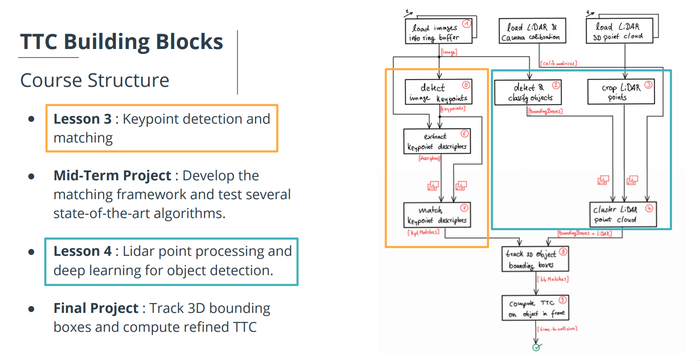

# SFND 3D Object Tracking

This repository implements a camera-lidar fusion pipeline for 3D object tracking and time-to-collision estimation. It combines 2D object detection, lidar point association, feature matching across frames, and TTC estimation from both camera and lidar data.

## How The Repo Works

The main execution flow lives in [src/cameraLidar.cpp](src/cameraLidar.cpp) and the fusion logic lives in [src/cam_Fusion.cpp](src/cam_Fusion.cpp).

The project runs in this sequence:

1. Detect objects in the camera image.
YOLO produces 2D bounding boxes for vehicles and other objects in the current frame.

2. Load and crop lidar points.
The lidar point cloud is filtered so the pipeline focuses on the region in front of the ego vehicle.

3. Project lidar points into the image.
Each 3D lidar point is transformed into camera coordinates and projected into image pixels.

4. Associate lidar points with camera ROIs.
If a projected lidar point falls inside a bounding box, it is assigned to that object. This is handled by `clusterLidarWithROI`.

5. Detect and describe image keypoints.
Keypoints are extracted from the current image and converted into descriptors that can be matched across frames.

6. Match keypoints between consecutive frames.
Descriptor matching gives image-level correspondences between the previous frame and the current frame.

7. Match bounding boxes over time.
The code uses keypoint correspondences to determine which bounding box in the previous frame matches which bounding box in the current frame. This is handled by `matchBoundingBoxes`.

8. Isolate the keypoint matches that belong to one object.
For a selected current bounding box, the pipeline keeps only the matches whose current keypoints fall inside that ROI and rejects obvious outliers. This is handled by `clusterKptMatchesWithROI`.

9. Compute TTC from lidar.
The object's distance in the previous and current frame is compared using associated lidar points. This is handled by `computeTTCLidar`.

10. Compute TTC from camera.
The object's scale change in the image is estimated from keypoint pair distance ratios. This is handled by `computeTTCCamera`.

In short, the fusion logic is:

- camera detection tells the system where objects are in 2D
- lidar provides direct depth for those objects
- keypoint tracking links the same object across frames
- TTC is then estimated independently from lidar and camera for the same physical target

## Key Files

- [src/cameraLidar.cpp](src/cameraLidar.cpp): main processing loop and pipeline orchestration
- [src/cam_Fusion.cpp](src/cam_Fusion.cpp): camera-lidar fusion and TTC functions
- [src/objectDetection2D.cpp](src/objectDetection2D.cpp): YOLO-based object detection
- [src/matching2D_Student.cpp](src/matching2D_Student.cpp): keypoint detection, description, and matching
- [src/dataStructures.h](src/dataStructures.h): shared data containers for frames, bounding boxes, and lidar points

## Repo Steps

1. Build the project with CMake.
2. Run `3D_object_tracking`.
3. The program loads synchronized camera and lidar frames.
4. Objects are detected in the image.
5. Lidar points are cropped, projected, and associated with image ROIs.
6. Keypoints are detected and matched across consecutive frames.
7. Bounding boxes are matched between frames.
8. TTC is estimated from lidar and camera cues for the tracked object.
9. Optional visualization windows show detections, lidar association, and fusion results.

## Dependencies for Running Locally
* cmake >= 2.8
  * All OSes: [click here for installation instructions](https://cmake.org/install/)
* make >= 4.1 (Linux, Mac), 3.81 (Windows)
  * Linux: make is installed by default on most Linux distros
  * Mac: [install Xcode command line tools to get make](https://developer.apple.com/xcode/features/)
  * Windows: [Click here for installation instructions](http://gnuwin32.sourceforge.net/packages/make.htm)
* Git LFS
  * Weight files are handled using [LFS](https://git-lfs.github.com/)
  * Install Git LFS before cloning this Repo.
* OpenCV >= 4.1
  * This must be compiled from source using the `-D OPENCV_ENABLE_NONFREE=ON` cmake flag for testing the SIFT and SURF detectors.
  * The OpenCV 4.1.0 source code can be found [here](https://github.com/opencv/opencv/tree/4.1.0)
* gcc/g++ >= 5.4
  * Linux: gcc / g++ is installed by default on most Linux distros
  * Mac: same deal as make - [install Xcode command line tools](https://developer.apple.com/xcode/features/)
  * Windows: recommend using [MinGW](http://www.mingw.org/)

## Basic Build Instructions

1. Clone this repo.
2. Make a build directory in the top level project directory: `mkdir build && cd build`
3. Compile: `cmake .. && make`
4. Run it: `./3D_object_tracking`.
